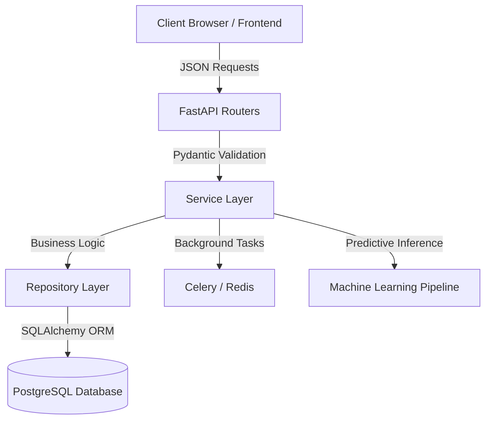
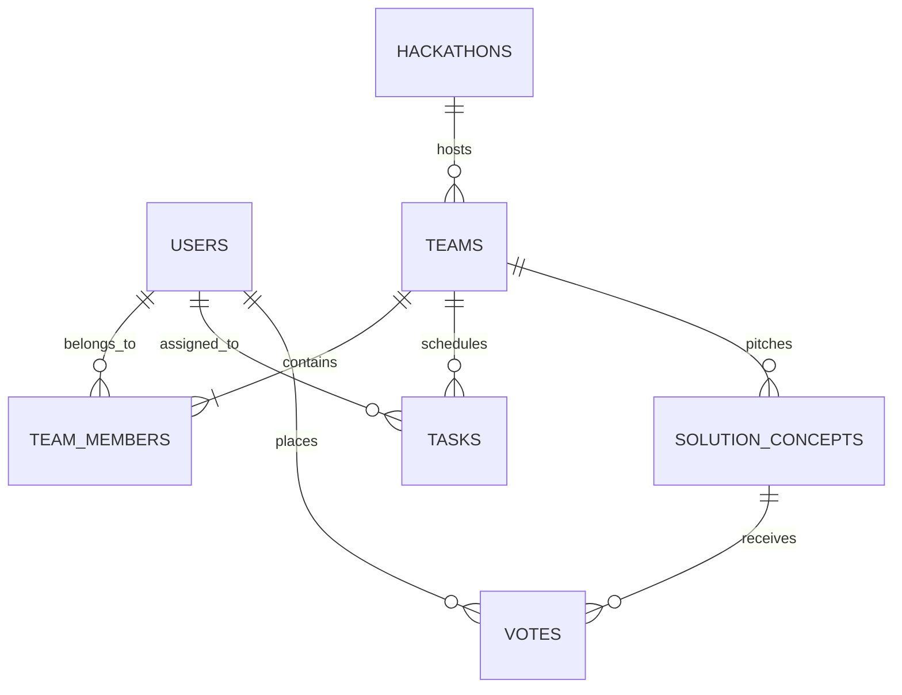
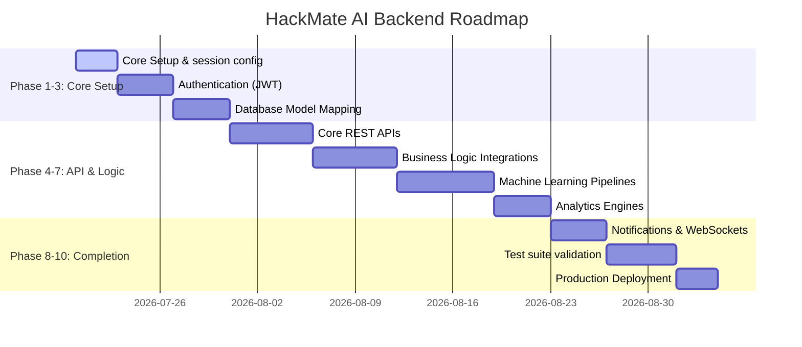

# HackMate AI — Backend & Python Architecture Blueprint

Welcome to the **HackMate AI Backend Architecture Blueprint**. This document serves as a comprehensive, step-by-step master plan to design and construct a production-ready, modular backend for HackMate AI.

This document is structured using educational, clear language to help student developers understand not only *what* is being designed, but *why* specific patterns are chosen, *where* components belong, and *how* they connect.

---

## 1. Core Architecture & Technology Stack

To support the real-time, interactive, and data-driven nature of HackMate AI, the backend is designed around a **clean architecture** split into distinct layers:
*   **Web Layer (FastAPI)**: Manages HTTP routing, handles web requests, and provides OpenAPI documentation.
*   **Business Logic Layer (Services)**: The "brain" of the backend. Contains the workflows, access checks, calculations, and rule enforcement.
*   **Data Access Layer (SQLAlchemy & Repositories)**: Manages communication with the database, shielding the rest of the application from SQL queries.
*   **Data Validation Layer (Pydantic)**: Defines the boundaries of data entering or leaving the system, ensuring security and correctness.



### Technology Selections: Why These Tools?

1.  **Python 3.10+**: Offers high developer velocity, rich ecosystem libraries, and native compatibility with machine learning toolkits.
2.  **FastAPI**: A high-performance, asynchronous web framework built on top of Starlette and Pydantic. It provides automated Swagger UI generation, strict type checking, and standard async/await support.
3.  **PostgreSQL**: A powerful, open-source object-relational database. Relational storage is ideal here because teams, hackathons, tasks, and users are highly structured and tightly coupled.
4.  **SQLAlchemy (v2.0+)**: Python's industry-standard Object-Relational Mapper (ORM). It abstracts database engines, allows Pythonic querying, and prevents raw SQL injection vulnerabilities.
5.  **Pydantic (v2.0+)**: Parses and validates data models. It automatically enforces types, strips out unexpected fields, and generates descriptive validation error responses.
6.  **Alembic**: A lightweight database migration tool for SQLAlchemy. It tracks database schema changes over time, allowing teams to evolve the database without losing data.
7.  **JWT (JSON Web Tokens)**: Stateless authentication tokens containing user identity and role information, signed securely by the backend server.
8.  **Redis (Optional Cache/Queue)**: Used to manage WebSocket chat channels, fast-tallying votes, and celery background task queues.
9.  **Scikit-Learn, Pandas, NumPy**: Standard ML libraries to clean profiles, compile contribution features, and run recommendation models.

---

## 2. Professional Directory Structure

The backend structure uses a **domain-focused clean architecture**. It separates core utilities, data layers, presentation logic, and machine learning components.

```text
backend/
├── app/
│   ├── core/                  # Core configurations, security rules, and global settings
│   │   ├── config.py          # Environment variable loaders (database URLs, JWT secrets)
│   │   ├── security.py        # Hashing functions and password validation helpers
│   │   └── dependencies.py    # Common FastAPI dependencies (database sessions, current user auth)
│   ├── database/              # Database setup and connection pools
│   │   ├── session.py         # SQLAlchemy engine setup and session generator
│   │   └── base.py            # Aggregated metadata for Alembic migrations
│   ├── models/                # Declarative SQLAlchemy database models
│   │   ├── user.py
│   │   ├── team.py
│   │   ├── hackathon.py
│   │   └── project.py
│   ├── schemas/               # Pydantic schemas for data serialization/validation
│   │   ├── user.py
│   │   ├── team.py
│   │   └── task.py
│   ├── routers/               # FastAPI endpoints organized by API resource
│   │   ├── auth.py
│   │   ├── teams.py
│   │   ├── tasks.py
│   │   └── workspace.py
│   ├── services/              # Business logic workflows (reusable across multiple routers)
│   │   ├── team_service.py    # Handles team creation, member verification, and balance checks
│   │   ├── task_service.py    # Handles task states, assignees, and progress recalculations
│   │   └── ml_service.py      # Hooks into model inference for matchmaking and checklist creation
│   ├── repositories/          # Direct DB querying layer (CRUD operations per table)
│   │   ├── user_repo.py
│   │   └── team_repo.py
│   ├── middleware/            # Custom HTTP request/response hook pipelines
│   │   └── logging.py         # Logs slow queries, API response times, and system usage
│   └── uploads/               # Local folder for user files (PDFs, PPTXs, diagrams)
├── ml/                        # Isolated Machine Learning Pipeline
│   ├── datasets/              # Sample/historical records for mock training
│   ├── trained_models/        # Serialized pipeline files (joblib, pickle)
│   ├── training/              # Training scripts and pipelines
│   │   ├── matchmaker_train.py
│   │   └── copilot_train.py
│   └── prediction/            # Live prediction and feature engineering functions
│       ├── matchmaker_predict.py
│       └── copilot_predict.py
├── tests/                     # Test suite (Unit, Integration, and API validation tests)
│   ├── conftest.py
│   ├── test_auth.py
│   └── test_teams.py
├── alembic/                   # Auto-generated database migration versions
├── requirements.txt           # Python application dependencies list
└── alembic.ini                # Configuration file for Alembic database migrations
```

### Why Do These Folders Exist?

*   `core/`: Ensures settings and secrets (like keys) are stored in one single source of truth, protected from leakage and easy to swap between staging and production.
*   `models/` vs `schemas/`: **Models** represent tables inside PostgreSQL. **Schemas** represent the JSON data format entering or leaving the API. Separating them prevents internal database fields (like `hashed_password`) from accidentally leaking to the frontend.
*   `routers/` vs `services/`: Routers only handle HTTP parameters, statuses, and return statements. Services handle the actual logical rules (e.g., checking if a user has exceeded their task limit). This keeps the code clean and reusable.
*   `repositories/`: Standardizes database calls. If the team decides to move from PostgreSQL to another database, only the repositories folder needs to be updated.
*   `ml/`: Kept separate from the web code. This ensures web server performance is not degraded during heavy training cycles, and allows data scientists to work without touching web routing logic.

---

## 3. Core Modules & Feature Analysis

For each frontend view identified in HackMate AI, the backend requires a corresponding set of files, schemas, database tables, and API interfaces.

---

### A. Dashboard & System Monitor
*   **Purpose**: Display active hackathon parameters, team sprint status, countdown clocks, system health metrics, and a live activities feed.
*   **Required Python Files**:
    *   `routers/dashboard.py` (API handles status aggregates)
    *   `services/dashboard_service.py` (Calculates live sprint status and progress ratios)
*   **Database Tables**: `hackathons`, `teams`, `tasks`, `system_logs`
*   **Business Logic**:
    *   Combine current team progress from completed tasks over total tasks.
    *   Recalculate remaining seconds until the hackathon deadline.
    *   Compile the latest 10 team action logs (e.g., "Elena uploaded file") into an activity stream.
*   **Validations**: Check if the requested team ID belongs to the active user session.

---

### B. Team Management
*   **Purpose**: Display team members, invite status, handle team creation, and manage the talent directory.
*   **Required Python Files**:
    *   `routers/teams.py` (Handles team and invite endpoints)
    *   `services/team_service.py` (Validates roster spots, checks membership limits)
*   **Database Tables**: `teams`, `team_members`, `invitations`
*   **Business Logic**:
    *   Limit team sizes to a maximum of 6 members (standard hackathon constraint).
    *   Ensure a user cannot join multiple teams in the same hackathon.
    *   Send and resolve invites (Pending $\rightarrow$ Accepted/Declined).
*   **Validations**:
    *   Email address format verification.
    *   Assert that the inviter is the team leader.

---

### C. Problem & Solution Lab
*   **Purpose**: Brainstorm and frame the core problem, document pain points, and pitch solution concepts.
*   **Required Python Files**:
    *   `routers/lab.py` (Endpoints for problem statements, pain points, and ideas)
    *   `services/lab_service.py` (Updates core statements, organizes idea ranks)
*   **Database Tables**: `problems`, `pain_points`, `solution_concepts`
*   **Business Logic**:
    *   Ensure only one active problem statement exists per team workspace.
    *   Associate custom pros/cons lists to pitched solution concepts.
*   **Validations**:
    *   Enforce a maximum text length on problem statements (e.g., 1000 characters).
    *   Verify that only team members can add pain points or pitch ideas.

---

### D. Voting Board
*   **Purpose**: Allow members to rate pitched concepts (0-5 stars) and automatically surface the leading team project.
*   **Required Python Files**:
    *   `routers/votes.py` (Endpoints for submitting ratings)
    *   `services/vote_service.py` (Tallying and calculating weighted averages)
*   **Database Tables**: `votes`, `solution_concepts`
*   **Business Logic**:
    *   Calculate the average rating score of solution concepts.
    *   Dynamically set the concept with the highest rating as the "Leading Solution Concept" on the team dashboard.
    *   Ensure each team member can only submit one rating per solution concept (updates existing ratings if resubmitted).
*   **Validations**:
    *   Enforce ratings to be between `0.0` and `5.0`.
    *   Reject votes from users who are not part of the workspace team.

---

### E. Discussion Board
*   **Purpose**: Provide sub-sprint chat channels and real-time developer communication.
*   **Required Python Files**:
    *   `routers/discussion.py` (HTTP endpoints and WebSocket handlers)
    *   `services/chat_service.py` (Message routing, history loaders)
*   **Database Tables**: `discussion_channels`, `discussion_messages`
*   **Business Logic**:
    *   Provide instant message broadcasting via WebSockets.
    *   Cache the latest 50 messages in Redis for ultra-fast initial channel loads.
*   **Validations**:
    *   Reject blank messages.
    *   Ensure users can only view or message channels belonging to their team workspace.

---

### F. Task Board (Kanban)
*   **Purpose**: Manage task backlogs, drag-and-drop cards between states, and assign tasks to teammates.
*   **Required Python Files**:
    *   `routers/tasks.py` (Task CRUD routes)
    *   `services/task_service.py` (Controls status transitions, dates, and comment loops)
*   **Database Tables**: `tasks`, `task_comments`
*   **Business Logic**:
    *   Automatically update team progress variables when a task state switches to `completed`.
    *   Log comments under tasks with user timestamps.
*   **Validations**:
    *   Validate deadline dates (must occur in the future and before the hackathon end date).
    *   Ensure the assigned user is an active member of the team.

---

### G. Project Workspace & Pitch Studio
*   **Purpose**: Manage Notion-style folder structures, edit markdown project notes, log presentation checklists, and view judge feedback.
*   **Required Python Files**:
    *   `routers/workspace.py` (File tree endpoints)
    *   `routers/pitch.py` (Checklists and judge ratings)
    *   `services/workspace_service.py` (Folder creations, markdown saves)
*   **Database Tables**: `workspace_folders`, `workspace_files`, `pitch_checklists`, `judge_feedbacks`
*   **Business Logic**:
    *   Implement folder hierarchy (parent/child relationships).
    *   Compile pitch progress checklists (e.g., count percentage of checked items).
*   **Validations**:
    *   Prevent duplicate folder names inside the same directory level.
    *   Validate slide deck file formats (accept only `.pdf`, `.pptx`, `.key`).

---

### H. Team Insights & Analytics
*   **Purpose**: Display contribution graphs, track task completion rates, and show technology distributions.
*   **Required Python Files**:
    *   `routers/analytics.py` (API endpoints for chart coordinates)
    *   `services/analytics_service.py` (Aggregates database metrics into frontend-ready JSON)
*   **Database Tables**: `tasks`, `team_members`, `solution_concepts`, `workspace_files`
*   **Business Logic**:
    *   Aggregate total contributions per member (computed as: Completed Tasks count + Submitted Solutions count + Document Uploads count).
    *   Analyze the team's tech stack usage by counting keywords in tasks and project descriptions.
*   **Validations**: Restrict access to team insights to active team members, assigned mentors, and hackathon coordinators.

---

### I. Hackathon Library & Knowledge Hub
*   **Purpose**: View past winning projects, browse guidelines, and review educational articles.
*   **Required Python Files**:
    *   `routers/library.py` (Endpoints for previous projects and guides)
    *   `services/library_service.py` (Fuzzy search engines and categories organizer)
*   **Database Tables**: `knowledge_hub_articles`, `archived_projects`
*   **Business Logic**:
    *   Retrieve past projects based on awards, technology used, or year.
    *   Support general reading permissions (accessible to all authenticated users).
*   **Validations**: Non-admin users are restricted to read-only access (no creating or editing articles).

---

### J. Profiles & Settings
*   **Purpose**: Manage personal user data, display certificates, choose custom development skill tags, and toggle themes.
*   **Required Python Files**:
    *   `routers/users.py` (Endpoints for user profiles)
    *   `services/user_service.py` (Profile updates, skill validations)
*   **Database Tables**: `users`
*   **Business Logic**:
    *   Support listing a user's skills and professional profile details.
    *   Calculate user experience (XP) scores based on platform achievements.
*   **Validations**: Enforce uniqueness constraints on emails and github handles.

---

### K. Admin Panel
*   **Purpose**: Allow coordinators to set up events, audit teams, read system monitors, review project repos, and assign scores.
*   **Required Python Files**:
    *   `routers/admin.py` (Administrative routes)
    *   `services/admin_service.py` (System audits, scoring reviews)
*   **Database Tables**: `hackathons`, `teams`, `users`, `system_logs`, `project_reviews`
*   **Business Logic**:
    *   Allow creators to input review checklist verifications (e.g., "compiles cleanly").
    *   Record and log final submission scores (0-100) assigned by faculty reviewers.
*   **Validations**: Ensure *only* accounts with the `Admin` or `Faculty` roles can access these endpoints.

---

## 4. Database Planning (Relational Schema)

This schema designs the backend relationships using standard relational database concepts without writing raw SQL.



### Table 1: users
*   **Purpose**: Stores credentials, role flags, profile metadata, and skill tags.
*   **Primary Key**: `id` (UUID)
*   **Fields**:
    *   `id` (UUID, PK) - Unique identifier
    *   `email` (VARCHAR, Unique, Indexed) - User email for logging in
    *   `hashed_password` (VARCHAR) - Password representation
    *   `full_name` (VARCHAR) - Display name
    *   `role` (VARCHAR) - Role flag (`student`, `leader`, `mentor`, `faculty`, `admin`)
    *   `skills` (ARRAY of VARCHAR) - Custom skill strings (e.g. `React`, `Python`)
    *   `xp_score` (INTEGER) - Gamification score
    *   `created_at` (TIMESTAMP WITH TIME ZONE)
*   **Indexes**: Index on `email` to accelerate authentication lookups.

### Table 2: hackathons
*   **Purpose**: Defines hackathon windows, categories, and sponsors.
*   **Primary Key**: `id` (UUID)
*   **Fields**:
    *   `id` (UUID, PK)
    *   `name` (VARCHAR, Indexed) - Name of the event
    *   `tagline` (VARCHAR) - Event slogan
    *   `start_date` (TIMESTAMP WITH TIME ZONE)
    *   `end_date` (TIMESTAMP WITH TIME ZONE)
    *   `status` (VARCHAR) - State flag (`upcoming`, `active`, `archived`)
*   **Indexes**: Index on `status` to filter active events quickly.

### Table 3: teams
*   **Purpose**: Represents a group workspace participating in an event.
*   **Primary Key**: `id` (UUID)
*   **Foreign Keys**: 
    *   `hackathon_id` (UUID $\rightarrow$ `hackathons.id`)
    *   `leader_id` (UUID $\rightarrow$ `users.id`)
*   **Fields**:
    *   `id` (UUID, PK)
    *   `name` (VARCHAR, Unique, Indexed) - Team name
    *   `avatar` (VARCHAR) - Initials icon
    *   `progress` (INTEGER) - Aggregated completion score
    *   `health_score` (INTEGER) - Health index
*   **Relationships**: One-to-many relationship with `tasks` and `solution_concepts`.

### Table 4: team_members
*   **Purpose**: Map table linking users to teams (handles many-to-many relationships).
*   **Primary Key**: `id` (UUID)
*   **Foreign Keys**:
    *   `team_id` (UUID $\rightarrow$ `teams.id`)
    *   `user_id` (UUID $\rightarrow$ `users.id`)
*   **Fields**:
    *   `id` (UUID, PK)
    *   `role_in_team` (VARCHAR) - Role inside the team (e.g. `Designer`, `ML Engineer`)
    *   `availability` (INTEGER) - Available time percentage
*   **Indexes**: Composite index on (`team_id`, `user_id`) for fast user-membership validation.

### Table 5: solution_concepts
*   **Purpose**: Pitches proposed by team members.
*   **Primary Key**: `id` (UUID)
*   **Foreign Keys**:
    *   `team_id` (UUID $\rightarrow$ `teams.id`)
    *   `author_id` (UUID $\rightarrow$ `users.id`)
*   **Fields**:
    *   `id` (UUID, PK)
    *   `title` (VARCHAR)
    *   `description` (TEXT)
    *   `pros` (ARRAY of VARCHAR)
    *   `cons` (ARRAY of VARCHAR)
    *   `average_score` (NUMERIC)
*   **Relationships**: One-to-many relationship with `votes`.

### Table 6: votes
*   **Purpose**: Rating entries submitted on solution concepts.
*   **Primary Key**: `id` (UUID)
*   **Foreign Keys**:
    *   `concept_id` (UUID $\rightarrow$ `solution_concepts.id`)
    *   `voter_id` (UUID $\rightarrow$ `users.id`)
*   **Fields**:
    *   `id` (UUID, PK)
    *   `rating` (NUMERIC) - Score (0.0 to 5.0)
    *   `comment` (TEXT)
*   **Indexes**: Composite index on (`concept_id`, `voter_id`) to enforce single-vote constraints.

### Table 7: tasks
*   **Purpose**: Kanban tasks assigned to project members.
*   **Primary Key**: `id` (UUID)
*   **Foreign Keys**:
    *   `team_id` (UUID $\rightarrow$ `teams.id`)
    *   `assignee_id` (UUID $\rightarrow$ `users.id`, Optional)
*   **Fields**:
    *   `id` (UUID, PK)
    *   `title` (VARCHAR)
    *   `description` (TEXT)
    *   `status` (VARCHAR) - State flag (`todo`, `in_progress`, `completed`)
    *   `priority` (VARCHAR) - Priority flag (`low`, `medium`, `high`)
    *   `deadline` (TIMESTAMP WITH TIME ZONE)
    *   `progress_percentage` (INTEGER)

---

## 5. API Planning (Routes & Permissions Matrix)

This matrix defines what CRUD endpoints are exposed and who is authorized to access them.

| Page / Feature | HTTP Method | Endpoint | Auth? | Authorized Roles | Description |
| :--- | :--- | :--- | :--- | :--- | :--- |
| **Auth** | POST | `/api/v1/auth/register` | No | Anonymous | Creates new user profiles |
| | POST | `/api/v1/auth/login` | No | Anonymous | Returns access and refresh JWTs |
| **Teams** | GET | `/api/v1/teams/workspace` | Yes | Student, Leader, Mentor, Faculty | Returns the active team context |
| | POST | `/api/v1/teams` | Yes | Student (becomes Leader) | Initializes a new team workspace |
| | POST | `/api/v1/teams/invite` | Yes | Leader | Sends an invitation to a student |
| | PUT | `/api/v1/teams/invite/{id}`| Yes | Student | Accepts or declines invitations |
| **Lab** | GET | `/api/v1/lab/problem` | Yes | Student, Leader, Mentor, Faculty | Retrieves the problem statement |
| | PUT | `/api/v1/lab/problem` | Yes | Leader | Updates the core problem statement |
| | POST | `/api/v1/lab/ideas` | Yes | Student, Leader | Pitches a new solution concept |
| **Votes** | POST | `/api/v1/votes` | Yes | Student, Leader | Casts a 0-5 rating on an idea |
| **Tasks** | GET | `/api/v1/tasks` | Yes | Student, Leader, Mentor, Faculty | Retrieves the team Kanban board |
| | POST | `/api/v1/tasks` | Yes | Student, Leader | Creates a new Kanban task card |
| | PUT | `/api/v1/tasks/{id}` | Yes | Student, Leader | Updates task status, assignee, or text |
| **Workspace**| GET | `/api/v1/workspace/tree` | Yes | Student, Leader, Mentor, Faculty | Returns folders and document list |
| | POST | `/api/v1/workspace/files` | Yes | Student, Leader | Uploads a new document file |
| **Admin** | GET | `/api/v1/admin/audit` | Yes | Admin, Faculty | Audits all systems and metrics |
| | POST | `/api/v1/admin/reviews` | Yes | Faculty | Submits project review evaluations |

---

## 6. Authentication & Session Architecture

HackMate AI uses **stateless JWT (JSON Web Tokens)** to authorize users without making database queries on every HTTP request.

### The Authentication Flow

```text
User Login ──> [Send Email & Password] ──> [Backend validates credentials]
                                                    │
    ┌───────────────────────────────────────────────┘
    ▼
[Generate & Sign 2 Tokens]
    ├── 1. Access Token (Short-lived: 15 minutes, used in Header)
    └── 2. Refresh Token (Long-lived: 7 days, stored in HTTP-Only Cookie)
```

1.  **Registration**:
    *   The user inputs their name, email, and password.
    *   The backend validates the email format, hashes the password using **bcrypt**, saves the user record to PostgreSQL, and assigns them the default `Student` role.
2.  **Login**:
    *   The user submits credentials.
    *   The backend retrieves the user record by email, compares the password hash, and generates two tokens:
        *   **Access Token**: Stores `user_id`, `role`, and token expiration time. Signed using a HS256 key.
        *   **Refresh Token**: Stores a unique token ID inside PostgreSQL to support remote session revocation.
3.  **Token Refreshing**:
    *   When the access token expires, the client frontend automatically sends the refresh token to `/api/v1/auth/refresh`.
    *   The backend verifies the refresh token signature, checks if the token has been blacklisted, and issues a brand-new access token.
4.  **Role & Permission Security**:
    *   FastAPI dependencies act as security guards. For example:
        *   `get_current_active_user`: Verifies the JWT signature.
        *   `check_role(["admin", "faculty"])`: Inspects the role field inside the decoded JWT, rejecting requests with a `403 Forbidden` status if the user lacks the required role.

---

## 7. Machine Learning Integrations

Machine Learning adds significant value to HackMate AI by automating coordination tasks and matching students with teams.

---

### A. Intelligent Hackathon Talent & Team Matchmaker
*   **Purpose**: Recommend available students to incomplete teams based on skill alignment, availability, and past project history.
*   **Problem It Solves**: In hackathons, students struggle to find teams that complement their skills (e.g., a frontend team looking for an ML developer).
*   **Inputs**:
    *   Target Team's current skills list (e.g. `["React", "CSS Grid", "Figma"]`).
    *   List of available students, including their listed skills, experience level, and certificates.
*   **Outputs**: Ranked list of recommended students with a similarity score (0.0 to 1.0).
*   **Algorithm**: **Content-Based Filtering / Cosine Similarity**
    *   Use Term Frequency-Inverse Document Frequency (TF-IDF) to convert skill tags and bio texts into mathematical vectors.
    *   Calculate the cosine angle similarity between the team's missing skill vectors and the candidate student vectors.
*   **Training Dataset**: Pre-compiled list of skills, certificates, and past team compositions.
*   **Evaluation Metrics**: **Precision at K (P@K)** (evaluates whether the top 3 recommended candidates match the team's needs).
*   **Retraining Strategy**: Retrain the TF-IDF vocabulary nightly to include new skill tags entered by users.

---

### B. Prompt-to-Checklist AI Task Copilot
*   **Purpose**: Automatically break down a high-level project idea or problem statement into a list of actionable project tasks.
*   **Problem It Solves**: Teams often lose valuable time at the start of a hackathon trying to plan out all the components and tasks they need to build.
*   **Inputs**:
    *   Pitched Solution description (e.g., *"Low-latency collaboration router using FastAPI and Redis"*).
*   **Outputs**: Array of task objects (title, description, proposed category).
*   **Algorithm**: **Supervised Sequence-to-Sequence (Text Summarization/Extraction)**
    *   A pre-trained Transformer model (e.g. distilled T5 or BART) fine-tuned on project plans and task directories.
*   **Features**: TF-IDF vectors of project pitches, mapped against templates of standard project structures (DB, API, frontend setup).
*   **Evaluation Metrics**: **ROUGE score** (compares how closely the AI's generated task checklist matches a human-created reference checklist).
*   **Retraining Strategy**: Triggered monthly, incorporating task templates that teams successfully created and completed.

---

### Why Other Features Do NOT Need ML

*   **Kanban Board Transitions**: Purely administrative database updates (moving a task from `todo` to `in_progress`). Forcing ML here adds unnecessary complexity without improving usability.
*   **Voting Board Calculations**: Simple arithmetic averages ($\text{Sum of scores} \div \text{Count of votes}$) are mathematically precise, transparent, and require zero training overhead.
*   **Chat Messaging**: Standard WebSocket connection handling is the most performant approach to route message text from user A to user B without latency.

---

## 8. Python File Planning

Below is a detailed map of the Python files required for implementation, ordered by their recommended phase of development.

### 1. `app/core/config.py`
*   **Purpose**: Loads system configurations and environment variables.
*   **Responsibilities**:
    *   Validate settings using Pydantic's `BaseSettings`.
    *   Configure DB connection strings, security tokens, and CORS policies.
*   **Inputs**: Environment variables (`.env`).
*   **Outputs**: Evaluated system configuration object.
*   **Phase**: **Phase 1 (Core Project Setup)**

### 2. `app/database/session.py`
*   **Purpose**: Setup database connection pooling and session context managers.
*   **Responsibilities**:
    *   Instantiate SQLAlchemy database engines.
    *   Provide thread-safe database session sessions (`get_db` generator).
*   **Inputs**: Database connection URL from configuration.
*   **Outputs**: Session generator for routers.
*   **Phase**: **Phase 1 (Core Project Setup)**

### 3. `app/models/user.py`
*   **Purpose**: Declarative SQLAlchemy database model representing the user accounts table.
*   **Responsibilities**: Map SQL columns (id, email, password, role) to python attributes.
*   **Dependencies**: `database/session.py` (Base class metadata).
*   **Phase**: **Phase 3 (Database Models)**

### 4. `app/schemas/user.py`
*   **Purpose**: Pydantic schemas validating user authentication parameters.
*   **Responsibilities**: Enforce correct formatting on registration payloads and sanitize profile output fields.
*   **Inputs**: HTTP Request JSON.
*   **Outputs**: Parsed Python data dictionaries.
*   **Phase**: **Phase 3 (Database Models)**

### 5. `app/services/task_service.py`
*   **Purpose**: Business logic layer managing tasks and Kanban pipelines.
*   **Responsibilities**:
    *   Calculate team sprint velocities.
    *   Automatically update team progress variables when a task is completed.
*   **Inputs**: Target task data and executing user identity.
*   **Outputs**: Updated task record.
*   **Dependencies**: `app/models/user.py`, `app/models/team.py`
*   **Phase**: **Phase 5 (Business Logic)**

### 6. `app/routers/tasks.py`
*   **Purpose**: HTTP endpoints routing requests to the task service.
*   **Responsibilities**: Handle parameter bindings, trigger permissions validations, and format responses.
*   **Inputs**: HTTP Request JSON, path parameters.
*   **Outputs**: HTTP response structures.
*   **Dependencies**: `app/services/task_service.py`
*   **Phase**: **Phase 4 (Core APIs)**

---

## 9. Development Roadmap

To build the HackMate AI backend systematically, follow this 10-phase road map.



### Phase 1: Core Project Setup
*   **Goal**: Initialize folders, configurations, and database connections.
*   **Tasks**:
    *   Configure `requirements.txt` with FastAPI, SQLAlchemy, Alembic, and Pydantic.
    *   Create the application folder structure.
    *   Establish database session configurations in `app/database/session.py`.
    *   Initialize Alembic (`alembic init alembic`).

### Phase 2: Authentication
*   **Goal**: Secure endpoints and implement user management.
*   **Tasks**:
    *   Implement user registration, password hashing, and login routes.
    *   Write JWT generation and decoding functions in `core/security.py`.
    *   Establish role verification dependencies in `core/dependencies.py`.

### Phase 3: Database Models
*   **Goal**: Establish the relational database schema.
*   **Tasks**:
    *   Write declarative models in `app/models/` for users, teams, hackathons, tasks, and votes.
    *   Run initial Alembic migrations to create tables inside PostgreSQL.

### Phase 4: Core APIs
*   **Goal**: Expose basic CRUD endpoints for the application.
*   **Tasks**:
    *   Write endpoints for listing hackathons, managing team members, and editing profiles.
    *   Write task endpoints to support listing, creating, and editing tasks on the Kanban board.
    *   Verify routing using FastAPI's auto-generated Swagger UI.

### Phase 5: Business Logic
*   **Goal**: Enforce application rules and workflow constraints.
*   **Tasks**:
    *   Implement team member count checks (max 6 members).
    *   Write the voting logic to calculate average concept ratings and update the leading project concept on the dashboard.
    *   Recalculate sprint completion percentages on database updates.

### Phase 6: Machine Learning
*   **Goal**: Integrate intelligent features into matchmaking and task planning.
*   **Tasks**:
    *   Develop the TF-IDF Cosine Similarity algorithm for student matchmaking in `ml/prediction/matchmaker_predict.py`.
    *   Write endpoints to recommend students based on team vacancies.
    *   Develop the automated task planning copilot to extract checklists from project pitches.

### Phase 7: Analytics
*   **Goal**: Aggregate workspace metrics for dashboards.
*   **Tasks**:
    *   Aggregate contributions metrics per team member.
    *   Expose tech stack distributions and velocity statistics.

### Phase 8: Notifications & WebSockets
*   **Goal**: Implement real-time communications and chat channels.
*   **Tasks**:
    *   Set up WebSocket endpoints for team chat channels.
    *   Integrate Redis to support WebSocket connections and message brokers.

### Phase 9: Testing
*   **Goal**: Validate backend security, performance, and correctness.
*   **Tasks**:
    *   Write unit tests for authentication utilities and services using Pytest.
    *   Write integration tests verifying that API routes return the expected payloads.

### Phase 10: Production Deployment
*   **Goal**: Deploy the backend application to cloud infrastructure.
*   **Tasks**:
    *   Configure production Dockerfiles.
    *   Deploy PostgreSQL instances on cloud database services.
    *   Deploy the FastAPI application to container engines (like Google Cloud Run) behind a secure load balancer.
