# HackMate AI — Enterprise Database Documentation

This document serves as the complete technical specification for the **HackMate AI** database layout, designed for **Neon Serverless PostgreSQL (v16+)**.

---

## 1. Database Overview

*   **Total Number of Tables**: 34 normalized (3NF) relational tables.
*   **Database Type**: Object-Relational Database Management System (ORDBMS) using PostgreSQL.
*   **Version Compatibility**: Fully optimized for PostgreSQL 16+ and Neon serverless platforms.
*   **Database Architecture**: 
    *   Uses **UUID v4** globally to support high scaling, prevent URL ID scanning vulnerabilities, and simplify database branching.
    *   Follows a **domain-driven schema design** where user authentication, workspace collaboration, project archives, and system audits are decoupled into logically isolated tables.
    *   Tracks updates via standardized **procedural PL/pgSQL triggers** for timestamps (`updated_at`), team progress calculations, and audit logs.
*   **Main Modules**: Authentication, User Profiles, Teams, Problem & Solution Lab, Discussion Board, Task Board, Workspace, Pitch Studio, Analytics, Hackathon Library, Settings, and Admin Portal.
*   **Overall Database Workflow**:
    ```text
    [User Signs Up] ──► INSERT to 'users' and 'user_roles_join'
           │
    [Team Formed]   ──► INSERT to 'teams' (Assigns Leader) and 'team_members'
           │
    [Brainstorming] ──► INSERT to 'problem_statements', 'pain_points', and 'solution_concepts'
           │
    [Collaboration] ──► INSERT to 'tasks' (Triggers progress calculations in 'teams')
           │            INSERT to 'messages' and 'document_versions'
           │
    [Submission]    ──► INSERT to 'presentations' and 'presentation_versions'
           │
    [Evaluation]    ──► INSERT to 'judge_reviews' (Faculty updates grades)
           │
    [Archive]       ──► INSERT to 'archived_projects' (Public historical searchable index)
    ```

---

## 2. Table Summary

| Table Name | Purpose | Primary Key | Columns | Related Module | Used By | Importance |
| :--- | :--- | :--- | :---: | :--- | :--- | :--- |
| `universities` | School directory for domain validation | `id` | 8 | Authentication | All Users | Critical |
| `departments` | Educational study categories | `id` | 8 | Authentication | Students | Medium |
| `users` | User credentials, skills, and XP | `id` | 13 | Profile | All Users | Critical |
| `roles` | Access control role definitions | `id` | 8 | Authentication | System | High |
| `user_roles_join` | Many-to-many bridge for roles | `id` | 4 | Authentication | System | High |
| `sessions` | Active login session tracking | `id` | 7 | Authentication | All Users | High |
| `hackathons` | Hackathon events and categories | `id` | 12 | Library | All Users | Critical |
| `teams` | Team workspace metadata and scores | `id` | 11 | Teams | Students | Critical |
| `team_members` | Many-to-many bridge for team rosters | `id` | 9 | Teams | Students | Critical |
| `team_invitations` | Outgoing recruitment requests | `id` | 9 | Teams | Team Leaders | High |
| `problem_statements`| Team project scope | `id` | 7 | Lab | Students | High |
| `pain_points` | Context pain points | `id` | 7 | Lab | Students | Medium |
| `solution_concepts` | Brainstormed project solutions | `id` | 13 | Lab | Students | High |
| `idea_votes` | Member ratings on solutions | `id` | 8 | Lab | Students | High |
| `discussion_channels`| Sub-sprint chat rooms | `id` | 9 | Discussions | Students | Medium |
| `messages` | Chat messages list | `id` | 9 | Discussions | Students | High |
| `tasks` | Kanban task items | `id` | 13 | Task Board | Students | Critical |
| `task_assignments` | Many-to-many bridge for task assignees| `id` | 4 | Task Board | Students | Critical |
| `task_comments` | User comments under tasks | `id` | 9 | Task Board | Students | Medium |
| `documents` | Workspace folders and document titles| `id` | 9 | Workspace | Students | High |
| `document_versions` | Version control edits for notes | `id` | 7 | Workspace | Students | High |
| `meeting_notes` | Team sync minutes | `id` | 9 | Workspace | Students | Medium |
| `architecture_files`| SVG structure diagrams | `id` | 9 | Workspace | Students | Medium |
| `presentations` | Final slide deck metadata | `id` | 9 | Pitch Studio | Team Leaders | High |
| `presentation_versions`| Presentation files history | `id` | 6 | Pitch Studio | Team Leaders | High |
| `notifications` | In-app alerts | `id` | 7 | Notifications | All Users | Medium |
| `activity_logs` | Real-time workspace monitors | `id` | 6 | Dashboard | Students | High |
| `badges` | Platform gamification trophies | `id` | 8 | Profiles | Students | Low |
| `badge_awards` | Many-to-many bridge for user badges | `id` | 4 | Profiles | Students | Low |
| `judge_reviews` | Faculty rubrics and feedback scores | `id` | 9 | Admin Panel | Faculty | High |
| `settings` | App preferences | `id` | 7 | Settings | All Users | Medium |
| `audit_logs` | High-security write history logs | `id` | 9 | System | Administrators | High |
| `archived_projects` | Searchable historical portfolio index| `id` | 12 | Library | All Users | Medium |
| `knowledge_hub_articles`| Guides and guidelines | `id` | 9 | Library | Organizers | Medium |

---

## 3. Table Details

---

### 1. universities
*   **Purpose**: Records schools participating in the hackathons to restrict email logins.
*   **Why it exists**: Prevents unauthorized registrations by ensuring students register with verified university domains (e.g. `stanford.edu`).
*   **Key Columns**:
    *   `id` (UUID, Primary Key)
    *   `name` (VARCHAR, Unique, Not Null) - e.g. "Stanford University"
    *   `email_domain` (VARCHAR, Unique, Not Null) - e.g. "stanford.edu"
*   **Relationships**: One-to-Many with `departments` and `users`.
*   **Indexes**: Unique index on `email_domain` for fast registration checks.
*   **Example Record**:
    ```json
    {
      "id": "aa14fe4c-d198-4c12-888e-64dfd236aa08",
      "name": "Stanford University",
      "email_domain": "stanford.edu"
    }
    ```
*   **Usage**: Checked during registration (`auth/register.html`).

---

### 2. departments
*   **Purpose**: Classifies student studies within universities.
*   **Why it exists**: Maps student study fields (e.g. "Computer Science") to enable skills and contribution analysis.
*   **Key Columns**:
    *   `id` (UUID, Primary Key)
    *   `university_id` (UUID, Foreign Key $\rightarrow$ `universities.id`)
    *   `name` (VARCHAR, Not Null) - e.g. "Computer Science"
*   **Relationships**: Many-to-One with `universities`. One-to-Many with `users`.
*   **Indexes**: B-Tree index on `university_id`.
*   **Example Record**:
    ```json
    {
      "id": "b34e5651-d4ea-4c91-a1e6-c1dfd4e6aa02",
      "university_id": "aa14fe4c-d198-4c12-888e-64dfd236aa08",
      "name": "Computer Science"
    }
    ```
*   **Usage**: Set in user settings and profiles (`student/profile.html`).

---

### 3. users
*   **Purpose**: Manages credentials, profile info, and experience scores.
*   **Why it exists**: Serves as the central repository for user profiles, credentials, and portfolios.
*   **Key Columns**:
    *   `id` (UUID, Primary Key)
    *   `email` (CITEXT, Unique, Not Null)
    *   `hashed_password` (VARCHAR, Not Null)
    *   `full_name` (VARCHAR, Not Null)
    *   `skills` (TEXT[] array)
    *   `xp_score` (INT)
*   **Relationships**: One-to-Many with `user_roles_join`, `sessions`, `team_members`, `solution_concepts`, `idea_votes`, `messages`, `task_assignments`, `document_versions`, `meeting_notes`, `architecture_files`, `presentation_versions`, `notifications`, `badge_awards`, `judge_reviews`, `audit_logs`, `knowledge_hub_articles`.
*   **Constraints**: `xp_score >= 0`.
*   **Indexes**: Partial index on `email` where `deleted_at IS NULL`.
*   **Example Record**:
    ```json
    {
      "id": "m-1-4a81-432d-9477-d35272a8c3d1",
      "email": "alex@bytecraft.io",
      "hashed_password": "$2b$12$eImiTXuWV5jihJQCl6S1uOw...",
      "full_name": "Alex Rivers",
      "skills": ["React", "Node.js", "System Design"],
      "xp_score": 940
    }
    ```
*   **Usage**: Authentication (`auth/login.html`) and Profile management (`student/profile.html`).

---

### 4. roles
*   **Purpose**: Stores authorization names and permission matrices.
*   **Why it exists**: Implements Role-Based Access Control (RBAC) to restrict administrative operations to authorized roles.
*   **Key Columns**:
    *   `id` (UUID, Primary Key)
    *   `name` (VARCHAR, Unique, Not Null) - e.g. `Super Admin`, `Faculty`, `Student`
    *   `permissions` (JSONB, default '{}') - e.g. `{"can_grade": true}`
*   **Relationships**: Many-to-Many with `users` via `user_roles_join`.
*   **Indexes**: Unique index on `name`.
*   **Example Record**:
    ```json
    {
      "id": "22b03f4a-81a1-432d-9477-d35272a8c3d2",
      "name": "Faculty",
      "permissions": {"can_grade": true, "can_pitch": false}
    }
    ```
*   **Usage**: Access control checks in the backend router middleware.

---

### 5. user_roles_join
*   **Purpose**: Bridge table for user-role relationships.
*   **Why it exists**: Maps many-to-many relationships between users and security roles.
*   **Key Columns**:
    *   `id` (UUID, Primary Key)
    *   `user_id` (UUID, Foreign Key $\rightarrow$ `users.id`)
    *   `role_id` (UUID, Foreign Key $\rightarrow$ `roles.id`)
*   **Indexes**: Composite index on (`user_id`, `role_id`).
*   **Example Record**:
    ```json
    {
      "id": "3d5f6a9d-b4ef-40bc-94ef-65d1b5e2d6b3",
      "user_id": "m-1-4a81-432d-9477-d35272a8c3d1",
      "role_id": "55e03f4a-81a1-432d-9477-d35272a8c3d5"
    }
    ```
*   **Usage**: Checked during login authentication checks.

---

### 6. sessions
*   **Purpose**: Stores active login tokens to support token refresh and session revocation.
*   **Why it exists**: Manages active user sessions, allowing remote logout by deleting or blacklisting refresh tokens.
*   **Key Columns**:
    *   `id` (UUID, Primary Key)
    *   `user_id` (UUID, Foreign Key $\rightarrow$ `users.id`)
    *   `refresh_token` (VARCHAR, Unique, Not Null)
    *   `expires_at` (TIMESTAMPTZ, Not Null)
*   **Relationships**: Many-to-One with `users`.
*   **Indexes**: B-Tree indexes on `refresh_token` and `user_id`.
*   **Example Record**:
    ```json
    {
      "id": "b3f6e56b-4e9b-4ea1-aa05-c1dfb4e6aa02",
      "user_id": "m-1-4a81-432d-9477-d35272a8c3d1",
      "refresh_token": "eyJhbGciOiJIUzI1NiIsInR5cCI6IkpXVCJ9...",
      "expires_at": "2026-07-26T09:00:00Z"
    }
    ```
*   **Usage**: Token refresh checks in the backend auth service.

---

### 7. hackathons
*   **Purpose**: Defines hackathon windows, categories, and sponsors.
*   **Why it exists**: Central directory of active, upcoming, and past hackathon events.
*   **Key Columns**:
    *   `id` (UUID, Primary Key)
    *   `name` (VARCHAR, Not Null)
    *   `start_date` (TIMESTAMPTZ, Not Null)
    *   `end_date` (TIMESTAMPTZ, Not Null)
    *   `status` (VARCHAR, default 'upcoming') - `upcoming`, `active`, `archived`
*   **Relationships**: One-to-Many with `teams`.
*   **Constraints**: `end_date > start_date`. Status must be one of: `upcoming`, `active`, `archived`.
*   **Indexes**: Index on `status` to filter active events.
*   **Example Record**:
    ```json
    {
      "id": "ghf-2026-c198-4c12-888e-64dfd236aa08",
      "name": "Global HackFest 2026",
      "start_date": "2026-07-16T09:00:00Z",
      "end_date": "2026-07-18T09:00:00Z",
      "status": "active",
      "categories": ["AI & Collaboration tools"]
    }
    ```
*   **Usage**: Event settings (`student/hackathon-library.html`, `admin/admin.html`).

---

### 8. teams
*   **Purpose**: Workspace containers for team members.
*   **Why it exists**: Serves as the primary parent table for team workspaces, tracking progress and team health.
*   **Key Columns**:
    *   `id` (UUID, Primary Key)
    *   `name` (VARCHAR, Not Null)
    *   `hackathon_id` (UUID, Foreign Key $\rightarrow$ `hackathons.id`)
    *   `leader_id` (UUID, Foreign Key $\rightarrow$ `users.id`)
    *   `progress_percentage` (INT, default 0)
    *   `health_score` (INT, default 100)
*   **Relationships**: One-to-Many with `team_members`, `team_invitations`, `problem_statements`, `solution_concepts`, `discussion_channels`, `tasks`, `documents`, `meeting_notes`, `architecture_files`, `presentations`, `activity_logs`, `judge_reviews`, `archived_projects`.
*   **Constraints**: Progress and health scores must be between 0 and 100.
*   **Indexes**: Unique composite index on (`hackathon_id`, `name`) where `deleted_at IS NULL` to prevent duplicate team names.
*   **Example Record**:
    ```json
    {
      "id": "t-1-bytecraft-workspace-id",
      "name": "ByteCraft",
      "hackathon_id": "ghf-2026-c198-4c12-888e-64dfd236aa08",
      "leader_id": "m-1-4a81-432d-9477-d35272a8c3d1",
      "progress_percentage": 68,
      "health_score": 94
    }
    ```
*   **Usage**: Dashboard (`student/dashboard.html`) and Team settings (`student/team.html`).

---

### 9. team_members
*   **Purpose**: Many-to-many relationship mapping users to teams.
*   **Why it exists**: Maps members to teams and defines their specific role within the team.
*   **Key Columns**:
    *   `id` (UUID, Primary Key)
    *   `team_id` (UUID, Foreign Key $\rightarrow$ `teams.id`)
    *   `user_id` (UUID, Foreign Key $\rightarrow$ `users.id`)
    *   `role_in_team` (VARCHAR, Not Null) - e.g. "UI/UX Designer"
    *   `availability_percentage` (INT, default 100)
*   **Constraints**: `availability_percentage BETWEEN 0 AND 100`.
*   **Indexes**: Unique index on (`team_id`, `user_id`) to prevent duplicate memberships.
*   **Example Record**:
    ```json
    {
      "id": "tm-1a2b-4a81-432d-9477-d35272a8c3d1",
      "team_id": "t-1-bytecraft-workspace-id",
      "user_id": "m-2-4a81-432d-9477-d35272a8c3d2",
      "role_in_team": "UI/UX Designer & Frontend Dev",
      "availability_percentage": 95
    }
    ```
*   **Usage**: Team roster checks (`student/team.html`).

---

### 10. team_invitations
*   **Purpose**: Logs invitations sent to students.
*   **Why it exists**: Tracks invitations sent to prospective members.
*   **Key Columns**:
    *   `id` (UUID, Primary Key)
    *   `team_id` (UUID, Foreign Key $\rightarrow$ `teams.id`)
    *   `email` (VARCHAR, Not Null)
    *   `status` (VARCHAR, default 'pending') - `pending`, `accepted`, `declined`
*   **Constraints**: Status must be one of: `pending`, `accepted`, `declined`.
*   **Indexes**: Index on (`team_id`, `email`, `status`) to track invitations.
*   **Example Record**:
    ```json
    {
      "id": "inv-1a2b-432d-9477-d35272a8c3d1",
      "team_id": "t-1-bytecraft-workspace-id",
      "email": "david@kim.dev",
      "suggested_role": "QA Engineer",
      "status": "pending",
      "expires_at": "2026-07-22T09:00:00Z"
    }
    ```
*   **Usage**: Team invites panel (`student/team.html`).

---

### 11. problem_statements
*   **Purpose**: Stores the team's defined problem statement.
*   **Why it exists**: Defines the problem the team is trying to solve.
*   **Key Columns**:
    *   `id` (UUID, Primary Key)
    *   `team_id` (UUID, Unique, Foreign Key $\rightarrow$ `teams.id`)
    *   `core_statement` (TEXT, Not Null)
*   **Relationships**: One-to-Many with `pain_points`.
*   **Constraints**: Unique constraint on `team_id` enforces a single problem statement per team.
*   **Example Record**:
    ```json
    {
      "id": "p-1-bytecraft-problem",
      "team_id": "t-1-bytecraft-workspace-id",
      "core_statement": "Traditional hackathons suffer from fragmented team communications..."
    }
    ```
*   **Usage**: Scoping workspace (`student/problem-solution-lab.html`).

---

### 12. pain_points
*   **Purpose**: Logs observed user pain points under the problem statement.
*   **Why it exists**: Stores specific user pain points related to the problem statement.
*   **Key Columns**:
    *   `id` (UUID, Primary Key)
    *   `problem_statement_id` (UUID, Foreign Key $\rightarrow$ `problem_statements.id`)
    *   `text` (TEXT, Not Null)
    *   `votes_count` (INT, default 0)
*   **Relationships**: Many-to-One with `problem_statements`.
*   **Indexes**: Index on `problem_statement_id`.
*   **Example Record**:
    ```json
    {
      "id": "pp-1a2b-432d-9477-d35272a8c3d1",
      "problem_statement_id": "p-1-bytecraft-problem",
      "text": "Context switching: Developers waste up to 30 mins...",
      "votes_count": 4
    }
    ```
*   **Usage**: Scoping board (`student/problem-solution-lab.html`).

---

### 13. solution_concepts
*   **Purpose**: Solution pitches submitted by team members.
*   **Why it exists**: Brainstorms and tracks solution ideas proposed by team members.
*   **Key Columns**:
    *   `id` (UUID, Primary Key)
    *   `team_id` (UUID, Foreign Key $\rightarrow$ `teams.id`)
    *   `author_id` (UUID, Foreign Key $\rightarrow$ `users.id`)
    *   `title` (VARCHAR, Not Null)
    *   `description` (TEXT, Not Null)
    *   `average_score` (NUMERIC(3,2), default 0.00)
*   **Relationships**: One-to-Many with `idea_votes`.
*   **Indexes**: Index on `team_id`.
*   **Example Record**:
    ```json
    {
      "id": "idea-1-hackmate-ai",
      "team_id": "t-1-bytecraft-workspace-id",
      "author_id": "m-1-4a81-432d-9477-d35272a8c3d1",
      "title": "HackMate AI - Unified Workspace",
      "description": "An integrated command center matching...",
      "average_score": 4.88
    }
    ```
*   **Usage**: Solution board (`student/problem-solution-lab.html`).

---

### 14. idea_votes
*   **Purpose**: Star ratings and feedback submitted on solution concepts.
*   **Why it exists**: Records rating scores (0-5 stars) and comments on pitched ideas.
*   **Key Columns**:
    *   `id` (UUID, Primary Key)
    *   `concept_id` (UUID, Foreign Key $\rightarrow$ `solution_concepts.id`)
    *   `voter_id` (UUID, Foreign Key $\rightarrow$ `users.id`)
    *   `rating` (NUMERIC(2,1), Not Null) - Range: 1.0 to 5.0
    *   `comment` (TEXT, Nullable)
*   **Constraints**: Rating score must be between 1.0 and 5.0.
*   **Indexes**: Unique index on (`concept_id`, `voter_id`) ensures each member votes only once per concept.
*   **Example Record**:
    ```json
    {
      "id": "v-1a2b-432d-9477-d35272a8c3d1",
      "concept_id": "idea-1-hackmate-ai",
      "voter_id": "m-2-4a81-432d-9477-d35272a8c3d2",
      "rating": 5.0,
      "comment": "Love the UI concepts."
    }
    ```
*   **Usage**: Voting board (`student/problem-solution-lab.html`).

---

### 15. discussion_channels
*   **Purpose**: Stores sub-channels (e.g. general, backend, frontend) inside a team's workspace.
*   **Why it exists**: Organizes discussion topics into distinct sub-channels.
*   **Key Columns**:
    *   `id` (UUID, Primary Key)
    *   `team_id` (UUID, Foreign Key $\rightarrow$ `teams.id`)
    *   `name` (VARCHAR, Not Null) - e.g. "general"
*   **Relationships**: One-to-Many with `messages`.
*   **Indexes**: Unique index on (`team_id`, `name`) where `deleted_at IS NULL` to prevent duplicate channel names.
*   **Example Record**:
    ```json
    {
      "id": "ch-1-general",
      "team_id": "t-1-bytecraft-workspace-id",
      "name": "general",
      "topic": "General team announcements"
    }
    ```
*   **Usage**: Sidebar channels list (`student/discussion-board.html`).

---

### 16. messages
*   **Purpose**: Log of chat messages.
*   **Why it exists**: Stores chat messages and emoji reactions within channels.
*   **Key Columns**:
    *   `id` (UUID, Primary Key)
    *   `channel_id` (UUID, Foreign Key $\rightarrow$ `discussion_channels.id`)
    *   `sender_id` (UUID, Foreign Key $\rightarrow$ `users.id`)
    *   `text` (TEXT, Not Null)
    *   `reactions` (JSONB, default '[]')
*   **Indexes**: Index on (`channel_id`, `created_at DESC`) for fast chat history loads.
*   **Example Record**:
    ```json
    {
      "id": "msg-1a2b-432d-9477-d35272a8c3d1",
      "channel_id": "ch-1-general",
      "sender_id": "m-1-4a81-432d-9477-d35272a8c3d1",
      "text": "Welcome to Global HackFest 2026!",
      "reactions": [{"emoji": "🔥", "count": 3}]
    }
    ```
*   **Usage**: Chat window (`student/discussion-board.html`).

---

### 17. tasks
*   **Purpose**: Stores Kanban task cards.
*   **Why it exists**: Records tasks on the team's Kanban board, including statuses and deadlines.
*   **Key Columns**:
    *   `id` (UUID, Primary Key)
    *   `team_id` (UUID, Foreign Key $\rightarrow$ `teams.id`)
    *   `title` (VARCHAR, Not Null)
    *   `status` (VARCHAR, default 'todo') - `todo`, `in_progress`, `completed`
    *   `priority` (VARCHAR, default 'medium') - `low`, `medium`, `high`
    *   `progress_percentage` (INT, default 0)
*   **Relationships**: One-to-Many with `task_assignments` and `task_comments`.
*   **Constraints**: Status must be `todo`, `in_progress`, or `completed`. Priority must be `low`, `medium`, or `high`.
*   **Indexes**: Index on (`team_id`, `status`) to filter tasks on the board.
*   **Example Record**:
    ```json
    {
      "id": "tk-1-design-vars",
      "team_id": "t-1-bytecraft-workspace-id",
      "title": "Establish Design System Variables",
      "status": "completed",
      "priority": "high",
      "progress_percentage": 100
    }
    ```
*   **Usage**: Kanban board (`student/task-board.html`).

---

### 18. task_assignments
*   **Purpose**: Many-to-many relationship mapping users to tasks.
*   **Why it exists**: Tracks task assignments within teams.
*   **Key Columns**:
    *   `id` (UUID, Primary Key)
    *   `task_id` (UUID, Foreign Key $\rightarrow$ `tasks.id`)
    *   `user_id` (UUID, Foreign Key $\rightarrow$ `users.id`)
*   **Indexes**: Composite index on (`task_id`, `user_id`).
*   **Example Record**:
    ```json
    {
      "id": "ta-1a2b-432d-9477-d35272a8c3d1",
      "task_id": "tk-1-design-vars",
      "user_id": "m-2-4a81-432d-9477-d35272a8c3d2"
    }
    ```
*   **Usage**: Task assignees profiles (`student/task-board.html`).

---

### 19. task_comments
*   **Purpose**: Comments left by team members on task cards.
*   **Why it exists**: Stores discussions and updates directly on task cards.
*   **Key Columns**:
    *   `id` (UUID, Primary Key)
    *   `task_id` (UUID, Foreign Key $\rightarrow$ `tasks.id`)
    *   `author_id` (UUID, Foreign Key $\rightarrow$ `users.id`)
    *   `text` (TEXT, Not Null)
*   **Indexes**: Index on (`task_id`, `created_at DESC`).
*   **Example Record**:
    ```json
    {
      "id": "tc-1a2b-432d-9477-d35272a8c3d1",
      "task_id": "tk-1-design-vars",
      "author_id": "m-1-4a81-432d-9477-d35272a8c3d1",
      "text": "Looks amazing, Sophia!"
    }
    ```
*   **Usage**: Task details card (`student/task-board.html`).

---

### 20. documents
*   **Purpose**: Files and notes stored in the workspace file tree.
*   **Why it exists**: Stores notes and documents organized by folder.
*   **Key Columns**:
    *   `id` (UUID, Primary Key)
    *   `team_id` (UUID, Foreign Key $\rightarrow$ `teams.id`)
    *   `title` (VARCHAR, Not Null)
    *   `folder_name` (VARCHAR, default 'Root')
*   **Relationships**: One-to-Many with `document_versions`.
*   **Indexes**: Index on `team_id`.
*   **Example Record**:
    ```json
    {
      "id": "doc-1-mvp-spec",
      "team_id": "t-1-bytecraft-workspace-id",
      "title": "Product Spec MVP",
      "folder_name": "Requirements"
    }
    ```
*   **Usage**: File tree list (`student/project-workspace.html`).

---

### 21. document_versions
*   **Purpose**: Tracks document history and edits over time.
*   **Why it exists**: Provides version control for document text.
*   **Key Columns**:
    *   `id` (UUID, Primary Key)
    *   `document_id` (UUID, Foreign Key $\rightarrow$ `documents.id`)
    *   `version_number` (INT, Not Null)
    *   `content` (TEXT, Not Null)
    *   `author_id` (UUID, Foreign Key $\rightarrow$ `users.id`)
*   **Constraints**: `version_number >= 1`.
*   **Indexes**: Composite index on (`document_id`, `version_number DESC`).
*   **Example Record**:
    ```json
    {
      "id": "dv-1a2b-432d-9477-d35272a8c3d1",
      "document_id": "doc-1-mvp-spec",
      "version_number": 1,
      "content": "### HackMate AI - Functional Specification...",
      "author_id": "m-1-4a81-432d-9477-d35272a8c3d1"
    }
    ```
*   **Usage**: Markdown text editor (`student/project-workspace.html`).

---

### 22. meeting_notes
*   **Purpose**: Stores markdown summaries of team sync meetings.
*   **Why it exists**: Keeps a log of meeting notes and dates.
*   **Key Columns**:
    *   `id` (UUID, Primary Key)
    *   `team_id` (UUID, Foreign Key $\rightarrow$ `teams.id`)
    *   `title` (VARCHAR, Not Null)
    *   `content` (TEXT, Not Null)
    *   `meeting_date` (DATE, Not Null)
    *   `author_id` (UUID, Foreign Key $\rightarrow$ `users.id`)
*   **Indexes**: Index on (`team_id`, `meeting_date DESC`).
*   **Example Record**:
    ```json
    {
      "id": "mn-1a2b-432d-9477-d35272a8c3d1",
      "team_id": "t-1-bytecraft-workspace-id",
      "title": "Kickoff Sync",
      "content": "### Kickoff Notes - Jul 16...",
      "meeting_date": "2026-07-16",
      "author_id": "m-1-4a81-432d-9477-d35272a8c3d1"
    }
    ```
*   **Usage**: Workspace notes list (`student/project-workspace.html`).

---

### 23. architecture_files
*   **Purpose**: SVG data of team design blueprints.
*   **Why it exists**: Saves system architecture layouts as SVG strings.
*   **Key Columns**:
    *   `id` (UUID, Primary Key)
    *   `team_id` (UUID, Foreign Key $\rightarrow$ `teams.id`)
    *   `title` (VARCHAR, Not Null)
    *   `svg_data` (TEXT, Not Null)
    *   `uploader_id` (UUID, Foreign Key $\rightarrow$ `users.id`)
*   **Indexes**: Index on `team_id`.
*   **Example Record**:
    ```json
    {
      "id": "arch-1a2b-432d-9477-d35272a8c3d1",
      "team_id": "t-1-bytecraft-workspace-id",
      "title": "Full Stack Topology",
      "svg_data": "<svg>...</svg>",
      "uploader_id": "m-1-4a81-432d-9477-d35272a8c3d1"
    }
    ```
*   **Usage**: SVG diagram editor (`student/architecture.html`).

---

### 24. presentations
*   **Purpose**: Tracks presentation slides prepared for judging.
*   **Why it exists**: Stores file size and metadata for presentation slide uploads.
*   **Key Columns**:
    *   `id` (UUID, Primary Key)
    *   `team_id` (UUID, Unique, Foreign Key $\rightarrow$ `teams.id`)
    *   `file_name` (VARCHAR, Not Null)
    *   `file_size_bytes` (BIGINT, Not Null)
    *   `current_version` (INT, default 1)
*   **Relationships**: One-to-Many with `presentation_versions`.
*   **Constraints**: Unique team constraint (one presentation per team). `file_size_bytes > 0` and `current_version >= 1`.
*   **Indexes**: Index on `team_id`.
*   **Example Record**:
    ```json
    {
      "id": "pres-1-bytecraft",
      "team_id": "t-1-bytecraft-workspace-id",
      "file_name": "HackMate_AI_Pitch_Draft.pptx",
      "file_size_bytes": 6081792,
      "current_version": 1
    }
    ```
*   **Usage**: Pitch file panel (`student/pitch-studio.html`).

---

### 25. presentation_versions
*   **Purpose**: Tracks version history of presentation slide decks.
*   **Why it exists**: Stores version history and cloud storage URLs for presentation slides.
*   **Key Columns**:
    *   `id` (UUID, Primary Key)
    *   `presentation_id` (UUID, Foreign Key $\rightarrow$ `presentations.id`)
    *   `version_number` (INT, Not Null)
    *   `file_path` (VARCHAR, Not Null) - e.g. Amazon S3 URL
    *   `uploader_id` (UUID, Foreign Key $\rightarrow$ `users.id`)
*   **Constraints**: `version_number >= 1`.
*   **Indexes**: Composite index on (`presentation_id`, `version_number DESC`).
*   **Example Record**:
    ```json
    {
      "id": "pv-1a2b-432d-9477-d35272a8c3d1",
      "presentation_id": "pres-1-bytecraft",
      "version_number": 1,
      "file_path": "https://s3.amazonaws.com/hackmate-files/ghf-2026/teams/t-1/presentations/v1_pitch_draft.pptx",
      "uploader_id": "m-1-4a81-432d-9477-d35272a8c3d1"
    }
    ```
*   **Usage**: File version manager (`student/pitch-studio.html`).

---

### 26. notifications
*   **Purpose**: Tracks app alerts and updates for users.
*   **Why it exists**: Stores in-app alerts and notifications.
*   **Key Columns**:
    *   `id` (UUID, Primary Key)
    *   `user_id` (UUID, Foreign Key $\rightarrow$ `users.id`)
    *   `title` (VARCHAR, Not Null)
    *   `message` (TEXT, Not Null)
    *   `is_read` (BOOLEAN, default False)
*   **Indexes**: Index on (`user_id`, `is_read`) to quickly return unread counts.
*   **Example Record**:
    ```json
    {
      "id": "n-1a2b-432d-9477-d35272a8c3d1",
      "user_id": "m-1-4a81-432d-9477-d35272a8c3d1",
      "title": "New Comment",
      "message": "Sophia Chen commented on task...",
      "is_read": false
    }
    ```
*   **Usage**: Notifications dropdown menu (`student/dashboard.html`).

---

### 27. activity_logs
*   **Purpose**: Feeds the real-time project monitor dashboard.
*   **Why it exists**: Records and displays team actions in an activity stream.
*   **Key Columns**:
    *   `id` (UUID, Primary Key)
    *   `team_id` (UUID, Foreign Key $\rightarrow$ `teams.id`)
    *   `user_id` (UUID, Foreign Key $\rightarrow$ `users.id`)
    *   `action_description` (VARCHAR, Not Null)
    *   `event_type` (VARCHAR, Nullable)
*   **Indexes**: Index on (`team_id`, `created_at DESC`) to show the latest activity logs.
*   **Example Record**:
    ```json
    {
      "id": "al-1a2b-432d-9477-d35272a8c3d1",
      "team_id": "t-1-bytecraft-workspace-id",
      "user_id": "m-2-4a81-432d-9477-d35272a8c3d2",
      "action_description": "Sophia Chen added task 'Setup variables'",
      "event_type": "task_creation"
    }
    ```
*   **Usage**: System logs feed (`student/dashboard.html`, `admin/admin.html`).

---

### 28. badges
*   **Purpose**: System gamification rewards.
*   **Why it exists**: Defines badges and XP milestones available on the platform.
*   **Key Columns**:
    *   `id` (UUID, Primary Key)
    *   `name` (VARCHAR, Unique, Not Null)
    *   `icon_url` (VARCHAR)
    *   `xp_required` (INT, default 0)
*   **Relationships**: Many-to-Many with `users` via `badge_awards`.
*   **Example Record**:
    ```json
    {
      "id": "b1e03f4a-81a1-432d-9477-d35272a8c301",
      "name": "First Commit",
      "description": "Successfully committed your first task...",
      "icon_url": "badge_first_commit.png",
      "xp_required": 50
    }
    ```
*   **Usage**: User achievements display (`student/profile.html`).

---

### 29. badge_awards
*   **Purpose**: Tracks badges awarded to users.
*   **Why it exists**: Maps many-to-many relationships between users and badges.
*   **Key Columns**:
    *   `id` (UUID, Primary Key)
    *   `user_id` (UUID, Foreign Key $\rightarrow$ `users.id`)
    *   `badge_id` (UUID, Foreign Key $\rightarrow$ `badges.id`)
*   **Indexes**: Composite index on (`user_id`, `badge_id`).
*   **Example Record**:
    ```json
    {
      "id": "ba-1a2b-432d-9477-d35272a8c3d1",
      "user_id": "m-1-4a81-432d-9477-d35272a8c3d1",
      "badge_id": "b1e03f4a-81a1-432d-9477-d35272a8c301"
    }
    ```
*   **Usage**: Awards profile section (`student/profile.html`).

---

### 30. judge_reviews
*   **Purpose**: Stores project evaluations submitted by organizers and faculty.
*   **Why it exists**: Logs scores and feedback assigned by judges.
*   **Key Columns**:
    *   `id` (UUID, Primary Key)
    *   `team_id` (UUID, Foreign Key $\rightarrow$ `teams.id`)
    *   `reviewer_id` (UUID, Foreign Key $\rightarrow$ `users.id`)
    *   `scoring_rubric` (JSONB, Not Null) - e.g. `{"innovation": 9}`
    *   `final_score` (NUMERIC(5,2), Not Null)
*   **Constraints**: `final_score` must be between 0.00 and 100.00.
*   **Indexes**: Index on `team_id`.
*   **Example Record**:
    ```json
    {
      "id": "jr-1a2b-432d-9477-d35272a8c3d1",
      "team_id": "t-1-bytecraft-workspace-id",
      "reviewer_id": "f-1-4a81-432d-9477-d35272a8c3e1",
      "scoring_rubric": {"innovation": 9, "feasibility": 8},
      "final_score": 85.00,
      "feedback_comments": "Stunning UI concept."
    }
    ```
*   **Usage**: Judge grading card (`admin/admin.html`) and Feedback section (`student/pitch-studio.html`).

---

### 31. settings
*   **Purpose**: Persists individual user application preferences.
*   **Why it exists**: Saves notification preferences and theme selections.
*   **Key Columns**:
    *   `id` (UUID, Primary Key)
    *   `user_id` (UUID, Unique, Foreign Key $\rightarrow$ `users.id`)
    *   `theme_preference` (VARCHAR, default 'light') - `light` or `dark`
    *   `is_email_notify` (BOOLEAN, default True)
*   **Constraints**: Theme preference must be `light` or `dark`.
*   **Indexes**: Index on `user_id`.
*   **Example Record**:
    ```json
    {
      "id": "s-1a2b-432d-9477-d35272a8c3d1",
      "user_id": "m-1-4a81-432d-9477-d35272a8c3d1",
      "theme_preference": "dark",
      "is_email_notify": true
    }
    ```
*   **Usage**: Settings page (`student/settings.html`).

---

### 32. audit_logs
*   **Purpose**: High-security audit log capturing all administrative data changes.
*   **Why it exists**: Tracks database updates for auditing purposes.
*   **Key Columns**:
    *   `id` (UUID, Primary Key)
    *   `user_id` (UUID, Nullable, Foreign Key $\rightarrow$ `users.id`)
    *   `action` (VARCHAR, Not Null) - e.g. `UPDATE_roles`
    *   `table_name` (VARCHAR, Not Null)
    *   `before_state` (JSONB, Nullable) - Data before change
    *   `after_state` (JSONB, Nullable) - Data after change
*   **Example Record**:
    ```json
    {
      "id": "aud-1a2b-432d-9477-d35272a8c3d1",
      "user_id": "a-1-4a81-432d-9477-d35272a8c3f1",
      "action": "UPDATE_roles",
      "table_name": "roles",
      "record_id": "22b03f4a-81a1-432d-9477-d35272a8c3d2",
      "before_state": {"permissions": {"can_grade": false}},
      "after_state": {"permissions": {"can_grade": true}}
    }
    ```
*   **Usage**: Admin portal audit log (`admin/admin.html`).

---

### 33. archived_projects
*   **Purpose**: Searchable index of completed hackathon projects.
*   **Why it exists**: Allows users to search and review past hackathon submissions.
*   **Key Columns**:
    *   `id` (UUID, Primary Key)
    *   `team_id` (UUID, Unique, Foreign Key $\rightarrow$ `teams.id`)
    *   `title` (VARCHAR, Not Null)
    *   `hackathon_name` (VARCHAR, Not Null)
    *   `technology_stack` (TEXT[] array)
*   **Indexes**: GIN index on `technology_stack` to accelerate tech stack searches.
*   **Example Record**:
    ```json
    {
      "id": "ap-1a2b-432d-9477-d35272a8c3d1",
      "team_id": "t-1-bytecraft-workspace-id",
      "title": "EcoPulse",
      "hackathon_name": "EcoHacks 2025",
      "award_won": "1st Place Winner",
      "technology_stack": ["Node.js", "Chart.js", "MongoDB"]
    }
    ```
*   **Usage**: Archives listing (`student/hackathon-library.html`).

---

### 34. knowledge_hub_articles
*   **Purpose**: Educational guides and reference material.
*   **Why it exists**: Stores reference articles and guides.
*   **Key Columns**:
    *   `id` (UUID, Primary Key)
    *   `title` (VARCHAR, Not Null)
    *   `content` (TEXT, Not Null)
    *   `author_id` (UUID, Foreign Key $\rightarrow$ `users.id`)
    *   `tags` (TEXT[] array)
*   **Indexes**: GIN index on `tags`.
*   **Example Record**:
    ```json
    {
      "id": "kh-1",
      "title": "Perfect Pitch Deck Guidelines",
      "summary": "Judges value clarity, impact...",
      "content": "Full markdown guide contents...",
      "author_id": "m-2-4a81-432d-9477-d35272a8c3d2",
      "tags": ["pitch", "guidelines"]
    }
    ```
*   **Usage**: Articles library (`student/knowledge-hub.html`).

---

## 4. Database Relationships

This diagram maps the primary conceptual relationships between tables:

```text
       ┌───────────────┐
       │  universities │
       └───────┬───────┘
               │1
               │*
       ┌───────▼───────┐             ┌───────────────┐
       │   departments │             │     roles     │
       └───────┬───────┘             └───────┬───────┘
               │1                            │1
               │*                            │*
       ┌───────▼───────┐             ┌───────▼───────┐
       │     users     │*           *│user_roles_join│
       └───┬───┬───┬───┘             └───────────────┘
           │1  │1  │1
           │   │   │
           │*  │*  │*
           │   │   │  ┌───────────────┐
           │   │   └──►    sessions   │
           │   │      └───────────────┘
           │   │      ┌───────────────┐
           │   └──────►  notifications│
           │          └───────────────┘
           │          ┌───────────────┐
           └──────────►    settings   │
                      └───────────────┘

       ┌───────────────┐
       │   hackathons  │
       └───────┬───────┘
               │1
               │*
       ┌───────▼───────┐             ┌───────────────┐
       │     teams     │1           *│  team_members │
       └───┬───┬───┬───┴────────────►└───────────────┘
           │1  │1  │1
           │   │   │
           │*  │1  │*
           │   │   │  ┌──────────────────┐
           │   │   └──►problem_statements│
           │   │      └────────┬─────────┘
           │   │               │1
           │   │               │*
           │   │      ┌────────▼─────────┐
           │   │      │    pain_points   │
           │   │      └──────────────────┘
           │   │      ┌──────────────────┐
           │   └──────►solution_concepts ◄──────────┐1
           │          └────────┬─────────┘          │
           │                   │1                   │*
           │                   │*                   │
           │          ┌────────▼─────────┐   ┌──────┴────────┐
           │          │    idea_votes    │   │     users     │
           │          └──────────────────┘   └───────────────┘
           │          ┌──────────────────┐
           └──────────►      tasks       ◄──────────┐1
                      └────────┬─────────┘          │
                               │1                   │*
                               │*                   │
                      ┌────────▼─────────┐   ┌──────┴────────┐
                      │ task_assignments ◄───┤     users     │
                      └──────────────────┘   └───────────────┘
```

---

## 5. Module Schema Definitions

---

### A. Authentication Module
*   **Tables**: `users`, `universities`, `departments`, `roles`, `user_roles_join`, `sessions`
*   **Workflow**: Validate email domain $\rightarrow$ Validate password hash $\rightarrow$ Create session record.
*   **Description**: Restricts registration based on university email domains.

---

### B. Profile Module
*   **Tables**: `users`, `badges`, `badge_awards`
*   **Workflow**: Retrieve user profiles $\rightarrow$ Display experience points (XP) and awarded badges.

---

### C. Team Module
*   **Tables**: `teams`, `team_members`, `team_invitations`
*   **Workflow**: Create team (assign leader) $\rightarrow$ Send member invitations $\rightarrow$ Join roster.

---

### D. Problem & Solution Lab Module
*   **Tables**: `problem_statements`, `pain_points`, `solution_concepts`
*   **Workflow**: Define problem scope $\rightarrow$ Add pain points $\rightarrow$ Pitch solutions.

---

### E. Discussion Board Module
*   **Tables**: `discussion_channels`, `messages`
*   **Workflow**: Load channels list $\rightarrow$ Stream messages via WebSocket connections.

---

### F. Task Board Module
*   **Tables**: `tasks`, `task_assignments`, `task_comments`
*   **Workflow**: Create task $\rightarrow$ Assign members $\rightarrow$ Update status (auto-recalculates team progress).

---

### G. Project Workspace Module
*   **Tables**: `documents`, `document_versions`, `meeting_notes`, `architecture_files`
*   **Workflow**: Create notes directory $\rightarrow$ Update document versions to track changes.

---

### H. Pitch Studio Module
*   **Tables**: `presentations`, `presentation_versions`, `judge_reviews`
*   **Workflow**: Upload presentation slides $\rightarrow$ Version slide history $\rightarrow$ Log review feedback.

---

## 6. Complete Database Flows

---

### A. User Registration Flow
```text
Validate University Domain (universities)
  └─► Insert new user credentials (users)
       └─► Assign 'Student' role (user_roles_join)
            └─► Initialize settings (settings)
```

---

### B. Create Team Flow
```text
Insert team metadata (teams)
  └─► Add leader to roster (team_members)
       └─► Log action event (activity_logs)
```

---

### C. Task Progress Flow
```text
Update task status to 'completed' (tasks)
  └─► Recalculate team progress (PL/pgSQL trigger)
       └─► Update progress percentage (teams)
            └─► Log task update (activity_logs)
```

---

## 7. Complete Entity Relationship Diagram (Mermaid)

```mermaid
erDiagram
    UNIVERSITIES ||--|{ DEPARTMENTS : contains
    UNIVERSITIES ||--o{ USERS : registers
    DEPARTMENTS ||--o{ USERS : classifies
    USERS ||--|{ USER_ROLES_JOIN : assigned
    ROLES ||--|{ USER_ROLES_JOIN : defines
    USERS ||--o{ SESSIONS : tracks
    USERS ||--o{ SETTINGS : manages
    USERS ||--o{ NOTIFICATIONS : receives
    
    HACKATHONS ||--o{ TEAMS : hosts
    USERS ||--o{ TEAMS : leads
    TEAMS ||--|{ TEAM_MEMBERS : contains
    USERS ||--|{ TEAM_MEMBERS : joins
    TEAMS ||--o{ TEAM_INVITATIONS : sends
    
    TEAMS ||--|| PROBLEM_STATEMENTS : defines
    PROBLEM_STATEMENTS ||--|{ PAIN_POINTS : contains
    TEAMS ||--o{ SOLUTION_CONCEPTS : proposes
    USERS ||--o{ SOLUTION_CONCEPTS : writes
    SOLUTION_CONCEPTS ||--o{ IDEA_VOTES : receives
    USERS ||--o{ IDEA_VOTES : casts
    
    TEAMS ||--o{ DISCUSSION_CHANNELS : contains
    DISCUSSION_CHANNELS ||--|{ MESSAGES : streams
    USERS ||--o{ MESSAGES : sends
    
    TEAMS ||--o{ TASKS : schedules
    TASKS ||--|{ TASK_ASSIGNMENTS : assigned_to
    USERS ||--|{ TASK_ASSIGNMENTS : performs
    TASKS ||--o{ TASK_COMMENTS : comments
    USERS ||--o{ TASK_COMMENTS : posts
    
    TEAMS ||--o{ DOCUMENTS : stores
    DOCUMENTS ||--|{ DOCUMENT_VERSIONS : tracks
    USERS ||--o{ DOCUMENT_VERSIONS : edits
    TEAMS ||--o{ MEETING_NOTES : records
    USERS ||--o{ MEETING_NOTES : writes
    TEAMS ||--o{ ARCHITECTURE_FILES : uploads
    USERS ||--o{ ARCHITECTURE_FILES : creates
    
    TEAMS ||--|| PRESENTATIONS : submits
    PRESENTATIONS ||--|{ PRESENTATION_VERSIONS : tracks
    USERS ||--o{ PRESENTATION_VERSIONS : uploads
    
    TEAMS ||--o{ ACTIVITY_LOGS : monitors
    USERS ||--o{ ACTIVITY_LOGS : performs
    
    USERS ||--o{ BADGE_AWARDS : receives
    BADGES ||--o{ BADGE_AWARDS : grants
    
    TEAMS ||--o{ JUDGE_REVIEWS : evaluates
    USERS ||--o{ JUDGE_REVIEWS : grades
    
    USERS ||--o{ AUDIT_LOGS : performs
    TEAMS ||--o{ ARCHIVED_PROJECTS : indexes
```



---

## 8. Database Statistics

*   **Total Tables**: 34
*   **Total Primary Keys**: 34 (all tables use UUID v4)
*   **Total Foreign Keys**: 44
*   **Lookup Tables**: 5 (`universities`, `departments`, `roles`, `badges`, `hackathons`)
*   **Junction Tables (Many-to-Many)**: 5 (`user_roles_join`, `team_members`, `task_assignments`, `badge_awards`, `archived_projects`)
*   **Master Tables**: 2 (`users`, `teams`)
*   **Transaction Tables**: 27 (records messages, tasks, documents, notifications, logs, and reviews)

---

## 9. Database Design Strengths

1.  **Strict 3NF Normalization**: Eliminates data redundancy. Group directories, user details, and roster memberships are decoupled into distinct lookup tables.
2.  **Scalability**: The use of UUID primary keys enables seamless database branching and horizontal scaling in Neon.
3.  **Neon Compatibility**: Optimized for Neon serverless PostgreSQL, utilizing PGBouncer for connection pooling to prevent resource exhaustion under load.
4.  **Database-Level Automation**: Uses PL/pgSQL triggers to automatically calculate team progress percentages and update timestamps.
5.  **Security**: Implements Role-Based Access Control (RBAC) and logs administrative updates in a secure audit log table.
6.  **Machine Learning Readiness**: Stores structured historical features (`skills`, `tech_stack`, `sprint_velocity`) to support future recommendation models.

---

## 10. Recommendations & Optimizations

Reviewing the database schema from the perspective of a Senior Database Architect reveals several optimization opportunities:

1.  **Audit Logs Partitioning**: The `audit_logs` table can grow rapidly in production. Partitioning the table monthly or quarterly using PostgreSQL range partitioning is recommended to maintain query performance.
2.  **Covering Indexes**: Frequently queried foreign keys, such as `tasks(team_id, status)` and `messages(channel_id, created_at DESC)`, are optimized with indexes. Adding covering indexes to retrieve frequently accessed columns directly from the index can further improve read speeds.
3.  **Soft Delete Index Optimization**: Tables using soft deletes should ensure indexes exclude deleted rows (e.g. `WHERE deleted_at IS NULL`) to keep indexes compact.
4.  **Rate Limiting Checks**: For tables prone to spam (like `messages`), database-level rate limiting or constraints can prevent spam.
